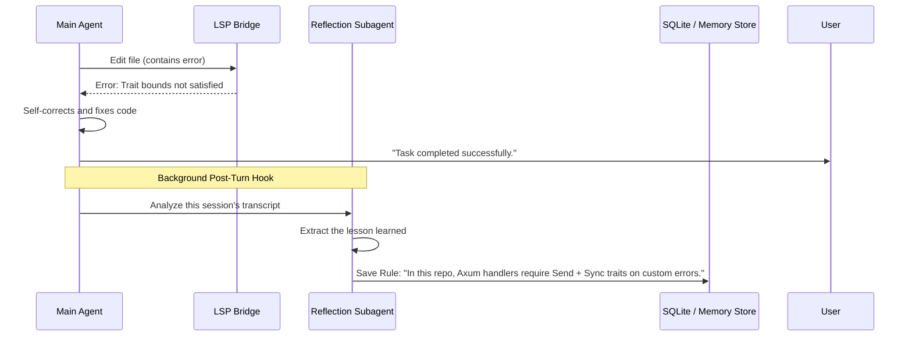

# Turya: Memory & Self-Improvement System

To fulfill the goal of a "self-improvement way," Turya cannot be amnesiac. It must remember your preferences, learn from its mistakes in a specific codebase, and manage its context window efficiently.

Turya implements a **Three-Tier Memory Architecture**.

---

## 1. Internal Plugin Architecture (`turya-plugin-memory`)

Adhering to the Turya Microkernel philosophy, the memory system is **not** hardcoded into `turya-core`. It is implemented as a first-party internal plugin (`turya-plugin-memory`) that interacts with the core entirely through the **Hook System** and **Event Bus**.

* **`pre_turn` Hook**: Injects retrieved semantic rules into the prompt just before the LLM generates tokens.
* **`on_event(TurnCompleted)` Hook**: Triggers the background SQLite persistence and reflection subagent.
* **`pre_context_overflow` Hook**: Triggers the compaction pipeline when the token budget hits a critical threshold.

---

## 2. Short-Term Memory (Working Context & Compaction)

The short-term memory is the active LLM context window. As tools execute (especially `grep` or `run_bash`), this window fills up rapidly, leading to "context collapse" (hallucinations or forgotten instructions).

### Context Compaction Pipeline
Turya monitors the token budget continuously. When the budget exceeds 80%, it triggers a compaction event:
1. **Tool Output Truncation**: Replaces massive compiler stack traces with just the head, tail, and the specific error codes.
2. **Turn Summarization**: Replaces 10 back-and-forth messages of a resolved debugging session with a single synthesized thought: *"[Thought: I debugged the auth middleware. The issue was a missing JWT header. The fix was applied to src/auth.rs.]"*
3. **Instruction Preservation**: The original user prompt and the core system instructions are *never* compacted.

---

## 2. Episodic Memory (Session History)

Every command, tool call, and token generated is saved to a local SQLite database (`~/.turya/turya.db`).

* **Resume Anytime**: You can close the terminal, reboot your machine, and type `turya resume` to drop exactly back into the middle of your debugging session.
* **Audit Trail**: You can view a timeline of exactly which files Turya modified over the last week.

---

## 3. Long-Term Memory (Self-Improvement & Semantic Rules)

This is where the "self-improvement" happens. Long-term memory is split into **Global User Memory** (across all projects) and **Project Memory** (specific to the current repo).

### The Reflection & Extraction Loop
When Turya successfully completes a complex task—especially one where it initially failed and had to use the LSP or compiler errors to correct itself—it spawns a lightweight background **Reflection Subagent**.

### Memory Injection
At the start of a new turn, Turya queries the Memory Store. 
If you ask it to "add a new route", it retrieves the rule: *"In this repo, Axum handlers require Send + Sync..."* and injects it into the system prompt invisibly. **It doesn't make the same mistake twice.**

### Storage Implementation
* **Format**: SQLite (`turya.db`).
* **Vector Search**: For advanced installations, `sqlite-vec` or `sqlite-vss` can be enabled, allowing Turya to semantically search its past memories based on the current prompt (e.g., retrieving how it solved a similar database migration 3 months ago).
* **Manual Editing**: Users can type `/memory` in the TUI to open an editor and manually add, edit, or delete stored rules (e.g., *"Always use double quotes in bash scripts"*, *"Never use Tailwind, use standard CSS"*).
