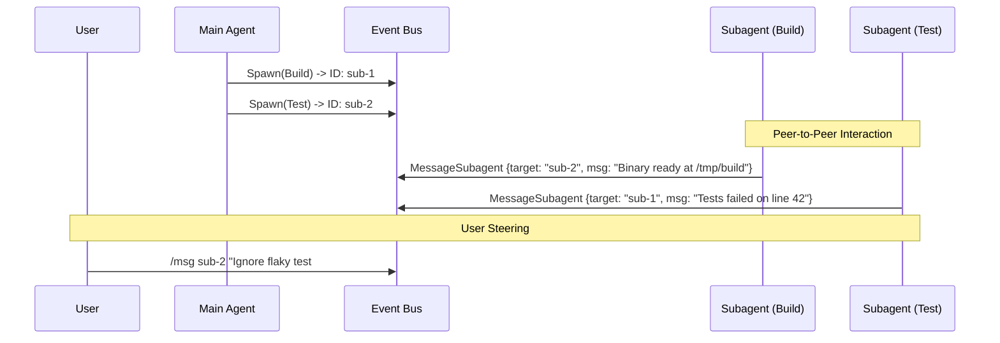

# Turya: Subagent & Plugin Architecture Specification

This document details the architecture for the two primary extensibility and concurrency mechanisms in Turya: **Subagents** (parallel AI actors) and **Plugins** (sandboxed community tools).

---

## 1. Subagent Architecture (The Actor Model)

Turya treats subagents as independent, asynchronous background tasks (Actors) rather than blocking function calls. This prevents the primary TUI and Main Agent from hanging during long operations.

### 1.1 Context & Isolation
Subagents do **not** share the parent agent's context window. This is a deliberate design choice ("Context Economy") to prevent a subagent's massive `grep` outputs or compiler errors from polluting the Main Agent's memory.
* **Input**: Inherits only the project `TURYA.md` rules and a specific `Prompt` from the parent.
* **Output**: Returns a synthesized summary of findings/actions upon completion.

### 1.2 Workspace Modes
When a parent agent spawns a subagent, it assigns a workspace isolation mode:
1. **`Inherit`**: Operates in the exact same directory as the parent. Best for read-only research or safe edits.
2. **`Worktree` (Git Worktree)**: Creates a temporary branched git worktree. The subagent can attempt speculative refactors, run destructive tests, or try complex migrations without touching the user's uncommitted changes. If successful, the parent can merge the diff.
3. **`Scratch`**: An isolated `/tmp/turya-session-xyz/` folder for executing untrusted code or isolated build experiments.

### 1.3 Subagent Communication (The Event Bus)
Because subagents are decoupled actors, they communicate via the central Tokio Event Bus using standard messages:

* **Parent-to-Child**: The Main Agent spawns a subagent and receives its ID. It can send follow-up constraints using `MessageSubagent { target: child_id, text }`.
* **Peer-to-Peer (Inter-Agent)**: Subagents *can* communicate with each other directly if they know the peer's ID. For example, a `Build` agent can send a message directly to a `Test` agent to verify a compiled binary, without polluting the Main Agent's context window.
* **User-to-Subagent**: The human user is an actor on the bus. By typing `/msg [subagent_id] [text]` in the TUI, the user can steer a specific subagent mid-task (e.g., *"Hey researcher, stop looking at the frontend, look at the backend folder instead"*).



---

## 2. Plugin Architecture (Extism Wasm Sandbox)

To support community extensions safely (without the security nightmare of arbitrary node.js/python scripts running on a user's machine), Turya uses **WebAssembly (WASI)** via [Extism](https://extism.org/).

### 2.1 Capability-Based Security
Community plugins are distributed as `.wasm` binaries. When Turya loads a plugin, it explicitly grants capabilities:
```toml
# Example turya-plugin.toml
[plugin.community-jira-integration]
wasm_url = "https://registry.turya.ai/jira-v1.wasm"
allowed_hosts = ["*.atlassian.net"]
allowed_paths = [] # No local filesystem access
```
If the plugin attempts to read `~/.ssh/id_rsa` or contact a malicious IP, the Wasm runtime instantly terminates it.

### 2.2 The "Any Language" Philosophy (Universal Wasm ABI)
To keep the Rust microkernel incredibly lightweight, Turya completely avoids embedding language-specific interpreters (no embedded V8, no embedded Lua runtime). 

Instead, **a plugin can be written in ANY language**.
Because Turya relies on Extism, WebAssembly (`.wasm`) is the universal boundary. Whether a developer writes a plugin in:
* TypeScript / JavaScript
* Lua
* Python
* Go / Zig
* Rust or C++

...they simply compile it to a `.wasm` file. The Turya engine does not care what language was originally used. It only cares that the Wasm sandbox receives JSON bytes and returns JSON bytes. This ensures infinite extensibility without bloating the core engine.

### 2.3 Plugin Multiplicity (1-to-N Mapping)
A crucial architectural rule: **A plugin is not restricted to a single tool.** 
A single plugin can bundle multiple tools, background tasks, and UI components. 
* *Example*: The internal `turya-plugin-github` does not just provide a single tool. It registers `create_pr`, `review_pr`, and `list_issues` to the Tool Registry, while simultaneously injecting a "PR Status" widget into the TUI status bar via the Event Bus.

### 2.4 Overriding Internal Plugins (Hooks & Priority)
A true microkernel allows users to completely replace its core behaviors. Turya achieves this through **Priority-based Routing** and **Middleware Hooks**.
* **High-Priority Shadowing**: Every tool registered in the Event Bus has a priority weight. Internal tools default to `priority: 0`. If you write a custom Wasm plugin that registers the `edit_file` tool with `priority: 10`, the Core Engine will route all future `edit_file` requests to *your* plugin instead of the internal one. This allows you to completely replace native capabilities.
* **Middleware Hooks (Interception)**: If you don't want to replace a tool, but just want to modify its behavior (e.g., adding security audit logs to every `run_bash` command), your Wasm plugin can register as Middleware. It subscribes to the `pre_tool_call` and `post_tool_call` lifecycle events. It can mutate the JSON parameters before they reach the internal plugin, or mutate the output before it returns to the LLM.

---

## 3. LSP Integration (Live Self-Correction)

Instead of relying solely on heavy `bash` commands like `cargo test` or `npm run build` to verify code, Turya integrates directly with the Language Server Protocol (LSP).

### The Mid-Turn Diagnostic Loop
1. **Action**: The Agent edits a file (`edit_file src/db.rs`).
2. **Intercept**: Before presenting the turn as complete to the user, Turya queries the local LSP (e.g., `rust-analyzer` or `tsserver`).
3. **Feedback**: If the LSP returns an error (e.g., `E0432: unresolved import`), Turya transparently feeds this back to the Agent as a system prompt: *"Your last edit caused a compiler error on line 12. Fix it."*
## 4. Session Isolation & Agent-to-Agent (A2A) Protocol

By default, every Turya session is strictly isolated. Running `turya` in Terminal A and `turya` in Terminal B spawns completely independent Microkernel processes with their own memory, token budgets, and temporary scratchpads.

### 4.1 Strict Isolation via IPC
Each active Turya session binds to a unique local socket (e.g., `/tmp/turya-session-<uuid>.sock` or a randomized local TCP port). They do not share state unless explicitly commanded to bridge.

### 4.2 The A2A (Agent-to-Agent) Bridge
If Turya Session A needs to delegate a task to Turya Session B (e.g., Session A is managing the Frontend, Session B is managing the Backend), they communicate using the **Turya A2A Protocol**.
* The A2A protocol is a standardized JSON-RPC interface natively supported by the Event Bus.
* **Command**: Session A emits `A2AMessage { target_session: "<uuid>", payload: "..." }`.

### 4.3 External Interoperability (Talking to Claude Code)
Because the Turya A2A socket adheres to open standards, it is completely interoperable with external, third-party agents.
* A running Turya session can expose itself as a standard **MCP (Model Context Protocol) Server**.
* You can configure **Claude Code**, **Cursor**, or **OpenCode** to connect to Turya's A2A socket.
* *Example Use Case*: You are using Claude Code, but you want to leverage Turya's highly-optimized Wasm plugins and Extism capabilities. You tell Claude Code to send a request over the MCP/A2A socket to Turya: *"Hey Turya, parse this 5GB CSV file using your Wasm tools and return the summary."* Turya does the heavy lifting in its isolated session and returns the result to Claude.
