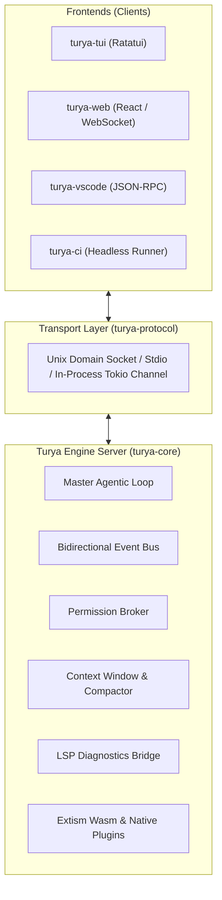

# Turya: Architecture, Core API & Implementation Plan

> **Product**: Turya (Configurable Agentic Coding & General Harness)  
> **Target**: Ultra-fast, modular, decoupled microkernel engine with TUI, WebUI, and Headless APIs.

---

## 1. Executive Summary & Design Tenets

Turya is designed as a high-performance alternative to Claude Code and OpenCode, built with the following core tenets:
1. **Microkernel Core**: The core engine is headless and contains zero hardcoded UI or provider logic. Everything is an event-driven plugin.
2. **The Self-Improvement Harness (Recursive Extensibility)**: The ultimate goal of the plugin system isn't just for humans to add tools—it is for the AI itself. If Turya lacks a capability, it can write a new Wasm plugin, compile it, and hot-reload it mid-session to permanently expand its own toolset. 
3. **Headless & UI-Agnostic (Core API First)**: All interactions occur through a strongly typed, bidirectional Client-Server Event Protocol (supporting in-process Tokio channels, Unix Domain Sockets, WebSockets, and stdio). The same core engine can power a Terminal UI (`ratatui`), Web UI (browser), VS Code extension, or CI/CD pipelines.
4. **Open Standards Alignment**:
   - **MCP (Model Context Protocol)** for external tools and enterprise datasources.
   - **SKILL.md / OpenSkills** for composable agent capabilities.
   - **LSP (Language Server Protocol)** for live compiler/type checker self-correction.
5. **Wasm Sandboxing for Community Extensions**: Community plugins run in WebAssembly via **Extism**, ensuring sandboxed, capability-gated security without compromising speed.
6. **Graduated Permission Model**: Supporting `open`, `review-for-me` (risk-tiered), and `manual` interactive modes.

---

## 2. Decoupled Core API Specification

The core engine is isolated into `turya-core` and exposed via `turya-protocol`. Frontends (TUI, WebUI, CLI) connect as clients.



### 2.1 Client-to-Engine Commands (`UI -> Engine`)

All commands are serialized via JSON or binary msgpack:

```rust
#[derive(Debug, Serialize, Deserialize)]
#[serde(tag = "type", content = "payload")]
pub enum TuryaCommand {
    /// Start a new conversational or coding turn
    SubmitPrompt {
        prompt: String,
        mode: AgentMode, // Plan, Build, General
        attached_files: Vec<PathBuf>,
    },
    /// Respond to a permission prompt from the engine
    ResolvePermission {
        request_id: String,
        decision: PermissionDecision, // AllowOnce, AllowSession, Deny
    },
    /// Send input to a running subagent
    MessageSubagent {
        subagent_id: String,
        message: String,
    },
    /// Abort current turn or specific subagent
    Abort {
        target: AbortTarget, // CurrentTurn, Subagent(id), All
    },
    /// Dynamically switch active model or permission mode
    UpdateConfig {
        model: Option<String>,
        permission_mode: Option<PermissionMode>,
    },
    /// Request session snapshot, history, or context token breakdown
    GetSessionState,
}
```

### 2.2 Engine-to-Client Events (`Engine -> UI`)

The engine broadcasts fine-grained events so UIs can stream tokens, update spinners, show diffs, and display interactive prompts:

```rust
#[derive(Debug, Clone, Serialize, Deserialize)]
#[serde(tag = "type", content = "payload")]
pub enum TuryaEvent {
    /// Incremental token streamed from the active LLM
    TokenDelta { chunk: String },
    /// Turn state transition
    TurnStarted { turn_id: String, mode: AgentMode },
    TurnCompleted { turn_id: String, summary: Option<String> },
    
    /// Tool execution lifecycle
    ToolCallInitiated { call_id: String, tool_name: String, parameters: serde_json::Value },
    ToolCallCompleted { call_id: String, result: ToolResult },
    
    /// Permission challenge (client must answer with ResolvePermission)
    PermissionRequested {
        request_id: String,
        action: String,
        risk_level: RiskLevel, // Low, Moderate, High, Critical
        details: serde_json::Value,
    },
    
    /// Subagent events
    SubagentSpawned { subagent_id: String, role: String, parent_id: Option<String> },
    SubagentEvent { subagent_id: String, event: Box<TuryaEvent> },
    SubagentFinished { subagent_id: String, status: ExitStatus },

    /// Live compiler / LSP diagnostics mid-turn
    LspDiagnosticsReceived {
        file: PathBuf,
        diagnostics: Vec<DiagnosticItem>, // Errors, warnings
    },

    /// Context economy updates
    ContextUpdated {
        used_tokens: usize,
        max_tokens: usize,
        compaction_triggered: bool,
    },

    /// General log / status message for notification toasts
    StatusMessage { level: LogLevel, text: String },
}
```

### 2.3 Real-time Streaming (WebUIs & Plugins)
Because the core engine is decoupled, streaming events (like `TokenDelta` or `StatusMessage`) must reach various clients efficiently:
* **Web UI / Electron (External Clients)**: `turya-server` binds an axum/warp server and exposes a **Server-Sent Events (SSE)** or **WebSocket** endpoint (e.g., `ws://localhost:9123/stream`). The WebUI subscribes to this stream and receives JSON-serialized `TuryaEvent`s in real-time, completely bypassing the TUI.
* **TUI/Wasm Plugins (Internal Clients)**: Wasm plugins run via Extism. Because Extism function calls are typically synchronous, a Wasm plugin that wants to stream data back to the core UI uses **Extism Host Functions**. The plugin calls `turya_emit_event(json_ptr)` from inside the sandbox, which the Rust host instantly forwards onto the central `tokio` event bus.

---

## 3. Performance & Low-End Machine Optimizations (The Rust Edge)

To ensure Turya feels instantaneous even on a 10-year-old laptop, the architecture enforces strict performance constraints:
1. **Zero-Cost Dependency Injection (Microkernel)**: `turya-core` is entirely decoupled. It communicates with plugins (tools, providers) using trait objects (`Arc<dyn ToolProvider>`), allowing the core binary to remain incredibly small.
2. **Trimmed Async Runtimes**: We strictly avoid the `tokio = { features = ["full"] }` trap. We only compile `rt-multi-thread`, `net`, and `fs`, reducing the final statically linked binary size by ~40%.
3. **I/O Bound Caching (SQLite WAL Mode)**: All session events stream to `turya.db`. To prevent disk I/O bottlenecks on old HDDs, Turya enforces SQLite Write-Ahead Logging (WAL) mode and batches inserts asynchronously.
4. **Memory-Mapped Files (`memmap2`)**: When Turya needs to parse a 5GB log file or CSV for a Wasm plugin, it uses memory-mapping (`mmap`). This avoids loading the entire file into RAM, entirely preventing Out-Of-Memory (OOM) crashes on low-spec machines.
5. **Lazy Reflection (Self-Improvement)**: Constantly spawning background LLM reflection agents wastes CPU and network bandwidth. Turya's self-improvement loop is *lazy*—it only triggers a reflection subagent if a task encountered a compiler/LSP error that required a correction, saving cycles on standard success paths.

---

## 4. Terminal UI (TUI) Wireframes & UX Mocks

The TUI is implemented in `ratatui` with 60 FPS non-blocking rendering driven by the core event stream.

### Mock 1: Default Interactive / Streaming Turn
```text
┌─ Turya v0.1.0 ────────────────────── [Provider: Claude 3.5 Sonnet] ── [Mode: Build] ── [Review-for-me] ┐
│                                                                                                          │
│ ❯ Add rate limiting to POST /api/v1/auth/login using token bucket algorithm                              │
│                                                                                                          │
│ [Turya] I will implement a token-bucket rate limiter for the login endpoint.                            │
│                                                                                                          │
│ ├── ⚡ Tool: view_file src/api/auth.rs                                                                   │
│ │   └─ Read 145 lines                                                                                    │
│ ├── ⚡ Tool: edit_file src/api/auth.rs                                                                   │
│ │   └─ Applied diff (+32 lines, -4 lines)                                                                │
│ └── 🔍 LSP Check: rust-analyzer                                                                          │
│     └─ ✔ 0 errors, 1 warning: unused import `std::time::Instant` (Auto-fixing...)                         │
│                                                                                                          │
│ Turya: I've updated `auth.rs` and added the token bucket middleware. Running tests now... ▋             │
│                                                                                                          │
├──────────────────────────────────────────────────────────────────────────────────────────────────────────┤
│ Context: 18,420 / 200,000 tokens (9%) │ Rate Limit: OK │ Cost: $0.04                                     │
├──────────────────────────────────────────────────────────────────────────────────────────────────────────┤
│ ❯ Ask Turya a follow-up or type / for commands...                                                      │
└─ [Enter] Send │ [Ctrl+C] Abort │ [Tab] Subagents (0) │ [/] Commands │ [?] Help ─────────────────────────┘
```

---

### Mock 2: Permission Challenge ("Review-for-me" Mode)
When the agent requests an operation classified as state-changing or risky (e.g. bash execution, deleting files, committing):

```text
┌─ Turya v0.1.0 ──────────────────────────────────────────────────────── [Review-for-me: Confirmation] ──┐
│                                                                                                          │
│  ⚠️  PERMISSION REQUESTED                                                                               │
│                                                                                                          │
│  Action:     run_bash                                                                                    │
│  Risk Level: MODERATE                                                                                    │
│  Command:    cargo test --package auth_service -- --nocapture                                            │
│  Reason:     Verifying that rate-limiting tests pass without regressions.                                │
│                                                                                                          │
│  Select an option:                                                                                       │
│  ❯ [y] Allow once (default)                                                                              │
│    [a] Always allow `cargo test` for this session                                                        │
│    [e] Edit command before running                                                                       │
│    [n] Deny action & explain to agent                                                                    │
│                                                                                                          │
├──────────────────────────────────────────────────────────────────────────────────────────────────────────┤
│ Use [Up/Down] to navigate, [Enter] to select, [Esc] to cancel.                                           │
└──────────────────────────────────────────────────────────────────────────────────────────────────────────┘
```

---

### Mock 3: Plan vs. Build Split-Pane View
When running in `Plan` mode, Turya creates a structured implementation specification before executing edits:

```text
┌─ Turya Plan Mode ───────────────────────────────────────────────────────────────────────────────────────┐
│ 📋 Task Plan: Migrate Database to PostgreSQL                     │ 🛠️ Workspace Inspector                 │
│ ──────────────────────────────────────────────────────────────── │ ──────────────────────────────────────│
│ [✔] Step 1: Research existing SQLite schemas & types             │ src/                                  │
│ [✔] Step 2: Add `sqlx-postgres` dependency to Cargo.toml         │  ├── db/                              │
│ [●] Step 3: Write migration script 002_postgres_schema.sql       │  │   ├── mod.rs                       │
│ [ ] Step 4: Implement connection pool with SSL support           │  │   └── schema.rs [MODIFIED]         │
│ [ ] Step 5: Update repository tests & verify against test DB     │  └── main.rs                          │
│                                                                  │                                       │
│ ──────────────────────────────────────────────────────────────── │ Active Diff: db/schema.rs             │
│ Current Step: Step 3 (Generating SQL schema...)                  │ @@ -12,4 +12,6 @@                     │
│ Target: migrations/20260924_pg_init.sql                          │ - INTEGER PRIMARY KEY AUTOINCREMENT   │
│                                                                  │ + BIGSERIAL PRIMARY KEY               │
├──────────────────────────────────────────────────────────────────┴───────────────────────────────────────┤
│ [Space] Toggle Step │ [P] Proceed to Build │ [E] Edit Plan │ [Tab] Switch Panes │ [Ctrl+C] Cancel        │
└──────────────────────────────────────────────────────────────────────────────────────────────────────────┘
```

---

### Mock 4: Concurrent Subagents Drawer / Split View
When Turya spawns background subagents (e.g. Researcher + Test Runner):

```text
┌─ Turya Workspace ───────────────────────────────────────────────────────────────────────────────────────┐
│ [Main Agent: Build] Writing integration tests...                                                         │
│                                                                                                          │
│ ┌─ Active Subagents (2 Active) ────────────────────────────────────────────────────────────────────────┐ │
│ │ [Tab 1: researcher-web] ── [Tab 2: cargo-test (worktree)] ───────────────────────────────────────────│ │
│ │ Subagent: researcher-web (Model: Fast / Read-Only)                                                   │ │
│ │ Status:   Searching docs for `tower-http` rate limiting layer...                                      │ │
│ │                                                                                                      │ │
│ │ > GET https://docs.rs/tower-http/latest/tower_http/trace/                                            │ │
│ │ > Found 3 examples matching TokenBucketLayer.                                                        │ │
│ │ > Synthesizing snippet for parent agent... (Done in 1.4s)                                            │ │
│ └──────────────────────────────────────────────────────────────────────────────────────────────────────┘ │
├──────────────────────────────────────────────────────────────────────────────────────────────────────────┤
│ Main: ❯ Waiting for subagent test results before committing.                                             │
└─ [Alt+1/2] Switch Subagent Tab │ [Ctrl+K] Kill Subagent │ [Enter] Open Detailed Transcript ──────────────┘
```

---

## 4. Project Crate & Workspace Structure

```text
turya/
├── Cargo.toml                   # Workspace manifest
├── crates/
│   ├── turya-core/             # The microkernel: event loop, context, token budget, state
│   ├── turya-protocol/         # Event & Command schemas (serde, JSON schema, Wasm-ready)
│   ├── turya-server/           # Headless RPC/WebSocket/UDS server
│   ├── turya-tools/            # Built-in primitive tools (view, edit, grep, glob, bash)
│   ├── turya-lsp/              # Language Server Protocol client for live feedback
│   ├── turya-plugins/          # Plugin manager:
│   │   ├── internal/            # Trait definitions for Native plugins
│   │   └── wasm-host/           # Extism / Wasmtime sandboxed runner
│   ├── turya-mcp/              # Model Context Protocol client implementation
│   ├── turya-tui/              # Terminal UI (Ratatui, non-blocking async client)
│   └── turya-cli/              # The unified entrypoint executable (`turya`)
├── docs/                        # Architecture decisions & Open standard specs
└── .plans/                      # Roadmap & architecture artifacts
```

---

## 5. WebUI Integration Architecture (Future-Proofing)

Because `turya-server` exposes the identical `turya-protocol` over WebSockets:
- A browser-based UI (e.g., Next.js / Solid.js with xterm.js or rich component views) can connect directly to `ws://localhost:9123`.
- Token streams, diffs, and permission approvals map 1:1 to browser event listeners.
- No changes to `turya-core` are required to support desktop, web, or remote cloud workspaces.

---

## 6. Implementation Roadmap

### Phase 1: Core Foundation & Protocol (Week 1)
- [ ] Initialize Cargo workspace with `turya-protocol`, `turya-core`, `turya-cli`.
- [ ] Define `TuryaCommand` and `TuryaEvent` schemas in `turya-protocol`.
- [ ] Implement the `MasterLoop` in `turya-core` with pluggable Provider traits (Anthropic & OpenAI/Gemini via SSE streaming).
- [ ] Implement standard primitive tools in `turya-tools`: `view_file`, `edit_file`, `grep_search`, `file_tree`, `run_bash`.

### Phase 2: Decoupled Server & Ratatui TUI (Week 2)
- [ ] Create `turya-server` supporting in-memory Tokio MPSC channels and Unix Domain Sockets.
- [ ] Build the `turya-tui` client using `ratatui` + `crossterm`.
- [ ] Implement streaming markdown rendering and interactive prompt input.
- [ ] Implement the Permission Broker with `open`, `review-for-me`, and `manual` modes.

### Phase 3: LSP Integration & Context Compaction (Week 3)
- [ ] Implement `turya-lsp` to query local LSP servers (e.g. `rust-analyzer`, `tsserver`, `pyright`).
- [ ] Wire mid-turn diagnostic feedback loop: auto-check modified files and feed compiler errors back to the model.
- [ ] Build multi-tier context compaction pipeline (summarizing old tool outputs, preserving instructions).

### Phase 4: Wasm Plugin Sandbox & MCP Client (Week 4)
- [ ] Embed Extism Wasm runtime in `turya-plugins/wasm-host`.
- [ ] Define the Turya Wasm Plugin ABI (supporting custom tools, filters, and skills).
- [ ] Implement JSON-RPC MCP client for stdio MCP servers.

### Phase 5: Multi-Agent Subagents & Self-Improvement (Week 5)
- [ ] Implement asynchronous subagent actor task runner in `turya-core`.
- [ ] Add `Plan` and `Build` dual-mode orchestration.
- [ ] Implement persistent project memory (`~/.turya/memories` and repo-local `TURYA.md`).
